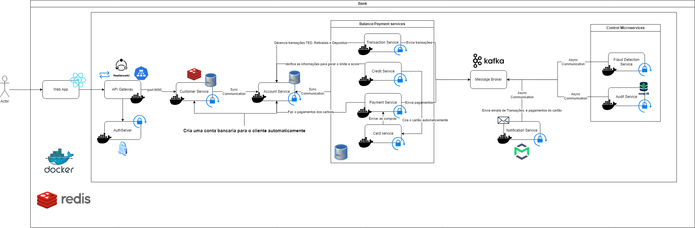

# Projeto de Banco com Microservices 🚀💸

Este projeto consiste em um sistema bancário desenvolvido usando uma arquitetura baseada em microservices. O objetivo é criar uma infraestrutura escalável e resiliente, capaz de lidar com diversas operações bancárias como criação de conta, transferências, gestão de crédito e pagamentos, além de funcionalidades de segurança como detecção de fraudes. O diagrama da arquitetura está representado abaixo:



## ✨Arquitetura

### 🧩 Componentes Principais

1. **Web App (React)**: Interface do usuário que permite o cliente interagir com o sistema, como criação de conta, consulta de saldo, transferências, entre outros. **(Não implementado)**

2. **API Gateway**: Responsável pelo roteamento das requisições do cliente para os diferentes microservices. Utiliza Resilience4J para garantir resiliência e balanceamento de carga.

3. **AuthServer**: Gerencia a autenticação dos usuários por meio do Keycloak, usando o Grant Type Client Credentials.

4. **Customer Service**: Gerencia informações dos clientes e cria automaticamente contas bancárias para novos clientes.

5. **Account Service**: Gerencia as contas bancárias dos clientes, incluindo operações como TED, retiradas e depósitos.

6. **Credit Service**: Realiza análise de crédito dos clientes e define os limites disponíveis para cartões de crédito.

7. **Payment Service**: Gerencia pagamentos de cartões de crédito e débito.

8. **Card Service**: Responsável pela criação e gestão dos cartões (físicos e virtuais).

9. **Transaction Service**: Gerencia transações como transferências e pagamentos.

10. **Notification Service**: Envia notificações por e-mail (implementado atráves do Mailtrap) para os clientes sobre transações e novos pagamentos no cartão.

11. **Fraud Detection Service**: Monitora as transações e pagamentos no cartão para detectar atividades suspeitas e evitar fraudes.

12. **Audit Service**: Registra todas as ações e eventos relevantes no sistema para fins de auditoria, armazenando os dados no MongoDB.

## ⚙️ Tecnologias Utilizadas

        .

- **Java Spring Boot**: Para desenvolvimento dos microservices.
- **Docker**: Para conteinerização dos microservices.
- **Kafka**: Para comunicação assíncrona entre os microservices.
- **Feign Client**: Para comunicação síncrona entre os microservices.
- **Redis**: Utilizado para caching e otimização de performance.
- **MySQL**: Banco de dados para armazenamento das informações dos clientes e transações.
- **MongoDB**: Utilizado pelo Audit Service para armazenar logs de auditoria.
- **Keycloak**: Para autenticação e autorização dos usuários.
- **Resilience4J**: Para implementar resiliência e controle de falhas.

## 💡 Funcionalidades Implementadas

- **Criação de Conta**: O sistema permite que novos clientes se cadastrem e tenham contas criadas automaticamente.
- **Transações Bancárias**: É possível realizar transferências, pagamentos e depósitos.
- **Análise de Crédito**: Avalia o perfil dos clientes e determina limites de crédito.
- **Cartões de Crédito e Débito**: Criação e gestão de cartões, incluindo limite e pagamentos.
- **Detecção de Fraudes**: Monitoramento de transações para identificar atividades suspeitas.
- **Auditoria**: Registro de eventos e atividades para fins de auditoria.
- **Notificação**: Envio de notificações sobre transações e atividades importantes.

## 🛠️ Como Executar o Projeto

### Requisitos
- **Docker** instalado para executar os microservices.
- **Java 17**.

### Passos para Execução
1. Clone o repositório:
   ```bash
   git clone https://github.com/nszandrew/bank-micro-services-spring-boot.git
   ```
2. Navegue até o diretório do projeto:
   ```bash
   cd bank-micro-services-spring-boot
   ```
3. Inicie os containers Docker:
   ```bash
   docker-compose up
   ```

## 🔗 Endpoints Disponíveis - http://localhost:9000

### Customer Service

- **Criar Conta no Banco**
  - **POST** `/api/customer`
  - Cria uma nova conta bancária para um cliente.

- **Encontrar Cliente**
  - **GET** `/api/customer/{id}`
  - Recupera informações de um cliente específico pelo ID.

- **Editar Cliente**
  - **PUT** `/api/customer/{id}`
  - Atualiza as informações de um cliente.

- **Deletar Cliente**
  - **DELETE** `/api/customer/{id}`
  - Remove um cliente do sistema.

### Account Service

- **Encontrar Conta pelo ID do Cliente**
  - **GET** `/api/account?idCustomer={idCustomer}`
  - Recupera as informações da conta de um cliente.

- **Encontrar Conta pelo Número da Conta**
  - **GET** `/api/account/accountnumber?accountNumber={accountNumber}`
  - Recupera a conta bancária pelo número da conta.

- **Trocar Tipo de Conta**
  - **PUT** `/api/account?accountType={accountType}&idCustomer={idCustomer}`
  - Atualiza o tipo da conta de um cliente.

### Transaction Service

- **Transferência TED**
  - **POST** `/api/transaction/ted`
  - Realiza uma transferência TED entre contas.

- **Saque**
  - **POST** `/api/transaction/withdraw?balance={balance}&idCustomer={idCustomer}`
  - Realiza um saque na conta do cliente.

- **Depósito**
  - **POST** `/api/transaction/deposit?balance={balance}&idCustomer={idCustomer}`
  - Realiza um depósito na conta do cliente.

### Credit Service

- **Ver Score e Crédito**
  - **GET** `/api/credit?accountNumber={accountNumber}`
  - Recupera o score e limite de crédito de um cliente.

- **Deletar Crédito**
  - **DELETE** `/api/credit?accountNumber={accountNumber}`
  - Remove o crédito associado a uma conta.

### Payment Service

- **Fazer Pagamento do Cartão**
  - **PUT** `/api/payment/pay?id={id}&accountNumber={accountNumber}`
  - Realiza o pagamento do cartão associado ao cliente.

### Card Service

- **Compra com Cartão de Crédito**
  - **PATCH** `/api/card/purchasecredit`
  - Realiza uma compra utilizando o cartão de crédito.

- **Compra com Cartão de Débito**
  - **GET** `/api/card/purchasedebit`
  - Realiza uma compra utilizando o cartão de débito.

- **Bloquear Cartão**
  - **PUT** `/api/card?accountNumber={accountNumber}&type={type}`
  - Bloqueia um cartão (físico ou virtual) associado a uma conta.

## 📄 Licença
Este projeto está licenciado sob a **Apache 2.0 License** - veja o arquivo [(LICENSE)](https://github.com/nszandrew/bank-micro-services-spring-boot/blob/main/LICENSE) para mais detalhes.
